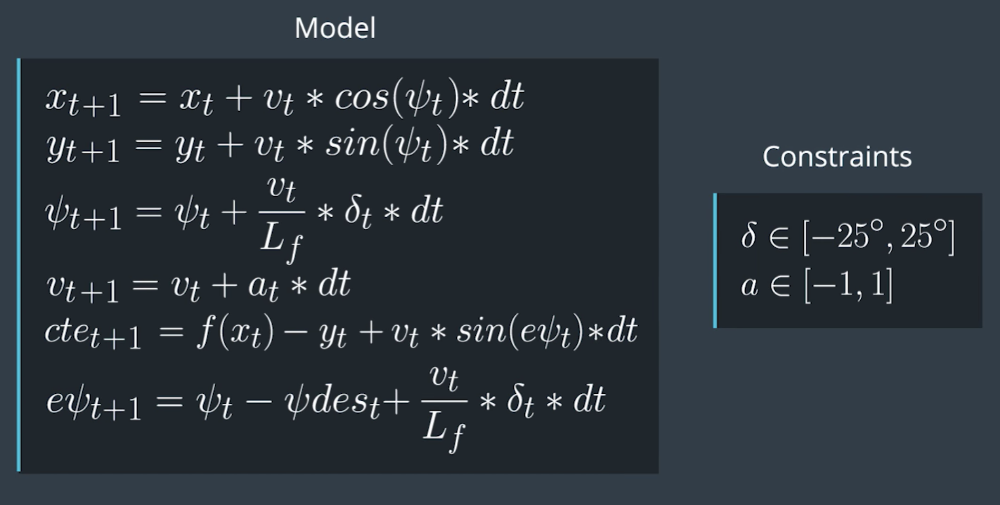

# CarND-Controls-MPC
Self-Driving Car Engineer Nanodegree Program

---

## Dependencies

* cmake >= 3.5
 * All OSes: [click here for installation instructions](https://cmake.org/install/)
* make >= 4.1(mac, linux), 3.81(Windows)
  * Linux: make is installed by default on most Linux distros
  * Mac: [install Xcode command line tools to get make](https://developer.apple.com/xcode/features/)
  * Windows: [Click here for installation instructions](http://gnuwin32.sourceforge.net/packages/make.htm)
* gcc/g++ >= 5.4
  * Linux: gcc / g++ is installed by default on most Linux distros
  * Mac: same deal as make - [install Xcode command line tools]((https://developer.apple.com/xcode/features/)
  * Windows: recommend using [MinGW](http://www.mingw.org/)
* [uWebSockets](https://github.com/uWebSockets/uWebSockets)
  * Run either `install-mac.sh` or `install-ubuntu.sh`.
  * If you install from source, checkout to commit `e94b6e1`, i.e.
    ```
    git clone https://github.com/uWebSockets/uWebSockets
    cd uWebSockets
    git checkout e94b6e1
    ```
    Some function signatures have changed in v0.14.x. See [this PR](https://github.com/udacity/CarND-MPC-Project/pull/3) for more details.

* **Ipopt and CppAD:** Please refer to [this document](https://github.com/udacity/CarND-MPC-Project/blob/master/install_Ipopt_CppAD.md) for installation instructions.
* [Eigen](http://eigen.tuxfamily.org/index.php?title=Main_Page). This is already part of the repo so you shouldn't have to worry about it.
* Simulator. You can download these from the [releases tab](https://github.com/udacity/self-driving-car-sim/releases).
* Not a dependency but read the [DATA.md](./DATA.md) for a description of the data sent back from the simulator.


## Basic Build Instructions

1. Clone this repo.
2. Make a build directory: `mkdir build && cd build`
3. Compile: `cmake .. && make`
4. Run it: `./mpc`.

## Rubric Points

### Your code should compile.

It does! See 'Basic Build Instructions' above.

### The Model.

The state consists of:
* coordinates (x, y)
* orientation
* velocity
* cross track error
* orientation error

Actuators:
* steering angle
* throttle/brake (as one value, positive or negative)

Update equations:



### Timestep Length and Elapsed Duration (N & dt)

`N` is 10, `dt` is 0.1 seconds. That means the model can predict 1 second into the future. That's ~26 meters (88 feet) if driving 60 MPH.
Seems like a sweet spot, bigger values (I tried `N`=20) don't seem to provide any improvements, but increase the computation time.

### Polynomial Fitting and MPC Preprocessing

Before processing, all coordinates are transformed to be relative to car current position and orientation (`main.cpp`, lines 101-106).
These points then are fitted into 3rd order polynomial on line 113.

### Model Predictive Control with Latency

Because of 100ms latency, current state doesn't go directly into MPC. Instead, a future state (100ms from current time) is predicted (`main.cpp`, lines 118-126).
This predicted state is fed into MPC. This is a big advantage over PID controller that always that cannot deal with actuation delays.

### The vehicle must successfully drive a lap around the track.

Here's the video:

[](https://www.youtube.com/watch?v=IVvz27Ay4mY)
